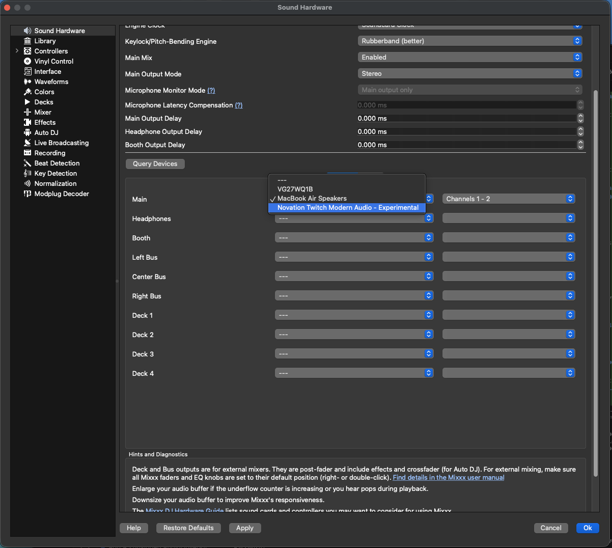

# USB-independent HAL feasibility probe

This Phase 1 probe publishes a virtual four-channel output device named
`Novation Twitch Modern Audio - Experimental`. It accepts 32-bit interleaved
floating-point Core Audio samples at 44.1 or 48 kHz and discards them.

It contains no USB code, never discovers or opens the Twitch, and produces no
physical audio output.

Build from the repository root:

```sh
scripts/audio/build-hal-probe.sh
```

The build downloads libASPL from its official GitHub repository at the exact
commit recorded in `audio/DEPENDENCIES.md`. The resulting bundle is ad-hoc signed
for local feasibility testing.

Installation and removal are separate administrator-authorized operations. Read
`audio/INSTALLATION_CONTRACT.md` before running either script.

A normal reboot is required after installation and after removal. The scripts do
not attempt to restart SIP-protected Core Audio services.

## Measured Phase 1 result

On arm64 macOS 26.5.2, the ad-hoc-signed bundle loaded after a normal reboot
with SIP enabled. Core Audio published four output channels and both discrete
sample rates, and StartIO/StopIO passed at 44.1 and 48 kHz. Mixxx 2.5.6 also
discovered the experimental device:


